# 信息架构图 — API 编排平台

> 基于产品核心数据模型：**资源(Resource) → 工具(Tool) → 流程(Flow) → 触发器(Trigger)**  
> 支持插件化扩展（资源类型 + 触发器类型）+ 多租户工作空间协作

---

## 1. 核心数据模型

```
┌─────────────────────────────────────────────────────────────────────┐
│                        平台核心模型                                   │
│                                                                     │
│   ┌──────────┐    ┌──────────┐    ┌──────────┐    ┌──────────┐      │
│   │  资源     │    │  工具     │    │  流程     │    │  触发器   │      │
│   │ Resource │───→│  Tool    │───→│  Flow    │───→│ Trigger  │      │
│   └──────────┘    └──────────┘    └──────────┘    └──────────┘      │
│                                                                     │
│   HTTP 服务        接口 (API)      节点编排        RESTful 入口      │
│   gRPC 服务       Service+方法    输入参数定义      定时任务          │
│   数据库           SQL 操作        返回结果         MQ 消费者         │
│   ... (插件)       ... (导入)       ...              ... (插件)       │
└─────────────────────────────────────────────────────────────────────┘
```

| 层级 | 说明 | 创建方式 | 依赖 |
|------|------|---------|------|
| **资源** | 外部系统的连接配置（连接地址、认证等） | 手动创建（选择资源类型） | 插件系统 |
| **工具** | 资源暴露的可调用能力 | 单个创建 / 批量导入（OpenAPI/proto/sqlc） | 所属资源 |
| **流程** | 编排调用已发布工具的逻辑 | 画布拖拽编排 | 已发布的工具 |
| **触发器** | 流程的外部入口，处理输入输出 | 创建 + 绑定流程 | 已发布的流程 |

### 账号体系模型（参考 ONES Account 设计）

```
┌─────────────────────────────────────────────────────────────────────┐
│                        账号与权限模型                                   │
│                                                                     │
│   ┌──────────┐    ┌──────────┐    ┌──────────┐    ┌──────────┐      │
│   │  用户     │    │  角色     │    │ 工作空间  │    │  权限     │      │
│   │  User    │───→│  Role    │───→│ Workspace│───→│Permission│      │
│   └──────────┘    └──────────┘    └──────────┘    └──────────┘      │
│                                                                     │
│   本地账号          平台预设         组织隔离         功能级            │
│   SSO 登录          工作空间自定义     成员归属         资源级            │
│   LDAP/AD          自定义角色        数据隔离         操作级            │
│                                                                     │
│   ┌──────────────────────────────────────────────────────┐          │
│   │ 认证方式                                              │          │
│   │ ● 本地账号（用户名/密码）                                │          │
│   │ ● SSO 单点登录（CAS / SAML / OAuth 2.0）               │          │
│   │ ● LDAP / Microsoft AD 对接                             │          │
│   │ ● 企业微信 / 钉钉 / 飞书 扫码登录                       │          │
│   │ ● 多因素认证 MFA（TOTP 验证码）                         │          │
│   └──────────────────────────────────────────────────────┘          │
└─────────────────────────────────────────────────────────────────────┘
```

| 层级 | 说明 | 细节 |
|------|------|------|
| **用户 User** | 平台登录账号，可属于多个工作空间 | 支持本地注册 / SSO 同步 / LDAP 导入 |
| **角色 Role** | 权限的集合，绑定到「用户-工作空间」关系 | 平台预设角色（不可删除）+ 工作空间自定义角色 |
| **工作空间 Workspace** | 组织隔离单元，拥有独立成员和权限配置 | 工作空间间资源/流程/触发器数据隔离 |
| **权限 Permission** | 功能操作的最小控制单元 | 模块级（资源/工具/流程/触发器）+ 操作级（创建/编辑/发布/删除）|

> **设计原则（参考 ONES）**：  
> - 用户与工作空间多对多关系，同一用户在不同工作空间可有不同角色  
> - 权限遵循最小权限原则，平台管理员可跨工作空间操作  
> - 已发布的工具跨工作空间可见，但编辑权限限于归属工作空间  

### 版本与依赖管理策略

```
┌─────────────────────────────────────────────────────────────────────┐
│                     版本锁定 & 依赖管理                                │
│                                                                     │
│   工具 v1 ──锁定──→ 流程 A (运行中 ✅)                                │
│   工具 v2 ──发布──→ 影响分析 → 通知流程 A 升级 🔄                      │
│   工具 v1 ──下线──→ 检查引用 → 有流程引用则阻止 ❌                       │
│                                                                     │
│   ┌───────────┐     ┌──────────────┐     ┌──────────────┐           │
│   │ 工具发布    │────→│ 自动检测依赖  │────→│ 通知下游流程  │           │
│   │ 新版本     │     │ 影响分析      │     │ 标记可升级 🔄 │           │
│   └───────────┘     └──────────────┘     └──────────────┘           │
│                           │                                         │
│                    ┌──────┴──────┐                                  │
│                    │ 有依赖流程?   │                                  │
│                    ├──────┬──────┤                                  │
│                    │ 有   │ 无   │                                  │
│                    │ ↓    │ ↓    │                                  │
│                    │阻止下线│允许下线│                                  │
│                    └──────┴──────┘                                  │
└─────────────────────────────────────────────────────────────────────┘
```

| 策略 | 说明 |
|------|------|
| **版本锁定** | 流程创建时锁定引用工具的具体版本（如 v2），运行时始终使用该版本 |
| **升级提醒** | 工具发布新版本后，依赖旧版本的流程在编排画布中标记 🔄，显示可升级节点 |
| **升级方式** | 支持单个节点升级或批量升级，升级后自动检测参数映射兼容性并提示迁移 |
| **发布前影响分析** | 工具发布新版本前，自动列出所有依赖旧版本的流程及其工作空间归属 |
| **下线保护** | 有流程引用（任何版本）的工具不允许下线，必须先移除所有流程中的引用 |
| **资源级联** | 资源下线前检查其下所有工具的下游依赖，汇总展示完整影响链路 |

> **触发器绑定策略**：触发器绑定流程时锁定流程版本，流程重新发布后需手动将触发器指向新版本（不自动升级，避免运行时意外）。

---

## 2. 全局导航模型

```
┌─────────────────────────────────────────────────────────────────────────────┐
│  顶部导航栏                                                                  │
│  ┌──────┐  ┌──────────┐  ┌──────┐  ┌──────┐  ┌──────┐  ┌──────┐  ┌──────┐│
│  │ Logo │  │ 工作空间切换器 │  │ 资源 │  │ 工具 │  │ 流程 │  │触发器│  │运行记录│ │
│  │      │  │ [交易WS ▾]   │  │      │  │      │  │      │  │      │  │      ││
│  └──────┘  └──────────┘  └──────┘  └──────┘  └──────┘  └──────┘  └──────┘│
│  ┌──┐  ┌──┐                                                        │
│  │⚙│  │👤│                                                        │
│  └──┘  └──┘                                                        │
└─────────────────────────────────────────────────────────────────────────────┘
```

### 导航层级说明

| 一级模块 | 入口位置 | 核心价值 | 工作空间协作 |
|---------|---------|---------|-------------|
| **资源管理** | 顶部导航 | 管理外部系统连接 | 工作空间 A 维护 |
| **工具管理** | 顶部导航 | 管理可调用能力 | 可能属于资源创建工作空间 |
| **流程编排** | 顶部导航 | 编排调用工具 | 工作空间 B 维护 |
| **触发器管理** | 顶部导航 | 配置流程入口 | 工作空间 C 维护 |
| **运行记录** | 顶部导航 | 查看执行历史和日志 | 跨工作空间可见（权限控制） |
| **账号与权限** | 头像下拉菜单 + `/settings/account` | 用户管理、角色配置、个人中心 | 平台管理员 + 个人 |
| **设置** | 下拉菜单 | 插件/认证/通知/全局配置 | 管理员 |

---

## 3. 模块信息架构树

```mermaid
graph TD
    ROOT[API 编排平台]

    ROOT --> RES[资源管理 Resource]
    ROOT --> TOOL[工具管理 Tool]
    ROOT --> FLOW[流程编排 Flow]
    ROOT --> TRIG[触发器管理 Trigger]
    ROOT --> LOG[运行记录]
    ROOT --> ACCOUNT[账号与权限]
    ROOT --> SETTINGS[设置]

    %% 资源管理
    RES --> R1[资源列表]
    R1 --> R1a[搜索 & 按类型/工作空间筛选]
    R1 --> R1b[创建资源]
    R1b --> R1b1[选择资源类型 - HTTP/gRPC/DB/...]
    R1b --> R1b2[配置连接信息]
    R1b --> R1b3[连接测试]
    R1 --> R1c[资源详情]
    R1c --> R1c1[连接配置]
    R1c --> R1c2[归属工作空间]
    R1c --> R1c3[归属工具列表]
    R1c --> R1c4[连接状态监控]

    %% 工具管理
    TOOL --> T1[工具列表]
    T1 --> T1a[搜索 & 按资源/工作空间/标签筛选]
    T1 --> T1b[创建工具]
    T1b --> T1b1[选择所属资源]
    T1b --> T1b2[单个创建 - 手动配置]
    T1b --> T1b3[批量导入 - OpenAPI/proto/sqlc]
    T1 --> T1c[工具详情 / 编辑]
    T1c --> T1c1[基础信息 Tab]
    T1c --> T1c2[参数配置 Tab - 输入/输出]
    T1c --> T1c3[测试面板]
    T1c --> T1c4[版本 & 发布状态]
    T1 --> T1d[发布/下线工具]
    T1 --> T1e[发布前影响分析]
    T1e --> T1e1[检测下游依赖流程列表]
    T1e --> T1e2[接口变更对比 Breaking/Non-breaking]
    T1e --> T1e3[影响范围摘要]

    %% 流程编排
    FLOW --> F1[流程列表]
    F1 --> F1a[搜索 & 按状态/工作空间筛选]
    F1 --> F1b[创建流程]
    F1b --> F1c[编排画布]
    F1c --> F1c1[左侧 - 工具面板 已发布工具列表]
    F1c --> F1c2[中央 - 编排画布]
    F1c --> F1c3[右侧 - 配置抽屉]
    F1c --> F1c4[底部 - 测试面板]
    F1c3 --> F1c3a[流程输入参数定义]
    F1c3 --> F1c3b[节点配置 - 工具参数映射 含锁定版本显示]
    F1c3 --> F1c3c[节点间数据映射]
    F1c3 --> F1c3d[条件分支 / 循环配置]
    F1c3 --> F1c3e[流程返回值定义]
    F1c4 --> F1c4a[运行日志]
    F1c4 --> F1c4b[节点执行详情]
    F1c4 --> F1c4c[执行时间线]
    F1 --> F1d[版本管理]
    F1 --> F1e[发布/下线流程]
    F1 --> F1f[工具版本升级提醒]
    F1f --> F1f1[画布中标记可升级的工具节点 🔄]
    F1f --> F1f2[查看新旧版本变更对比]
    F1f --> F1f3[单个节点升级或批量升级]
    F1f --> F1f4[升级后参数映射自动迁移提示]

    %% 触发器管理
    TRIG --> TG1[触发器列表]
    TG1 --> TG1a[搜索 & 按类型/流程/工作空间筛选]
    TG1 --> TG1b[创建触发器]
    TG1b --> TG1b1[选择触发器类型 RESTful/Timer/MQ/...]
    TG1b --> TG1b2[绑定目标流程]
    TG1b --> TG1b3[输入映射 - 外部请求→流程参数]
    TG1b --> TG1b4[输出映射 - 流程结果→外部响应]
    TG1 --> TG1c[触发器详情]
    TG1c --> TG1c1[触发器配置]
    TG1c --> TG1c2[输入输出映射配置]
    TG1c --> TG1c3[调用统计]
    TG1c --> TG1c4[调用日志]

    %% 运行记录
    LOG --> L1[运行记录列表]
    L1 --> L1a[搜索 & 按触发器/工作空间/状态/时间筛选]
    L1 --> L1b[运行详情]
    L1b --> L1b1[执行概览 触发器/流程/状态/耗时]
    L1b --> L1b2[节点执行时间线]
    L1b --> L1b3[数据流追踪 输入→各节点→输出]
    L1b --> L1b4[结构化日志]

    %% 账号与权限
    ACCOUNT --> AC1[登录 / 注册]
    AC1 --> AC1a[本地账号 用户名/密码]
    AC1 --> AC1b[SSO 单点登录 CAS/SAML/OAuth]
    AC1 --> AC1c[LDAP/AD 对接登录]
    AC1 --> AC1d[企业微信/钉钉/飞书 扫码登录]
    AC1 --> AC1e[多因素认证 MFA TOTP]
    ACCOUNT --> AC2[个人中心]
    AC2 --> AC2a[基本信息 姓名/邮箱/头像]
    AC2 --> AC2b[账号安全 修改密码/MFA设置]
    AC2 --> AC2c[我的工作空间 查看所属工作空间]
    AC2 --> AC2d[个人 API Keys 创建/管理]
    AC2 --> AC2e[语言与时区偏好设置]
    ACCOUNT --> AC3[用户管理 仅平台管理员]
    AC3 --> AC3a[用户列表 搜索/筛选/启禁用]
    AC3 --> AC3b[邀请用户 邮箱邀请/链接邀请]
    AC3 --> AC3c[用户详情 查看所属工作空间和角色]
    ACCOUNT --> AC4[角色与权限]
    AC4 --> AC4a[平台预设角色 管理员/负责人/开发者/只读]
    AC4 --> AC4b[工作空间自定义角色 创建/编辑]
    AC4 --> AC4c[权限配置 矩阵式勾选]

    %% 设置
    SETTINGS --> S1[工作空间管理]
    S1 --> S1a[工作空间列表 & 切换]
    S1 --> S1b[工作空间成员管理]
    S1 --> S1c[工作空间角色与权限]
    SETTINGS --> S2[系统设置]
    S2 --> S2a[插件管理 资源类型/触发器类型]
    S2 --> S2b[全局认证配置]
    S2 --> S2c[通知 & 告警设置]

    style ROOT fill:#4F46E5,color:#fff
    style RES fill:#6366F1,color:#fff
    style TOOL fill:#6366F1,color:#fff
    style FLOW fill:#6366F1,color:#fff
    style TRIG fill:#6366F1,color:#fff
    style LOG fill:#6366F1,color:#fff
    style ACCOUNT fill:#F59E0B,color:#fff
    style SETTINGS fill:#6366F1,color:#fff
    style F1c fill:#22C55E,color:#fff
    style T1c fill:#22C55E,color:#fff
    style TG1b fill:#22C55E,color:#fff
    style S1 fill:#F59E0B,color:#fff
```



---

## 4. 核心页面结构详细设计

### 4.1 资源列表页

```
┌─────────────────────────────────────────────────────────────────────┐
│ 资源管理                                              [+ 新建资源]   │
├─────────────────────────────────────────────────────────────────────┤
│ 搜索框 [/]                                    类型: 全部 ▾  工作空间: 全部 ▾│
├──────┬──────────────────────────────────────┬───────┬───────┬──────┤
│ 类型  │ 资源名称                              │ 连接状态│ 工具数 │ 工作空间│
├──────┼──────────────────────────────────────┼───────┼───────┼──────┤
│ HTTP │ 用户服务 User Service                  │ 🟢 正常 │  12   │ 交易WS │
│ HTTP │ 订单服务 Order Service                 │ 🟢 正常 │   8   │ 交易WS │
│ gRPC │ 支付网关 Payment Gateway               │ 🔴 异常 │   5   │ 支付WS │
│ DB   │ 主数据库 Main DB                       │ 🟢 正常 │   3   │ 基础WS │
│ HTTP │ 第三方物流 Logistics API               │ 🟡 慢   │   2   │ 交易WS │
└──────┴──────────────────────────────────────┴───────┴───────┴──────┘
```

### 4.2 资源创建流程（支持多种类型）

```
┌─────────────────────────────────────────────────────────────┐
│ 创建资源                                                     │
│                                                             │
│  选择资源类型                                                 │
│  ┌──────────┐  ┌──────────┐  ┌──────────┐  ┌──────────┐   │
│  │  HTTP    │  │  gRPC    │  │  数据库   │  │  + 更多  │   │
│  │  服务    │  │  服务    │  │  MySQL   │  │  插件    │   │
│  │  🌐      │  │  🔗      │  │  🗄️      │  │  🧩      │   │
│  └──────────┘  └──────────┘  └──────────┘  └──────────┘   │
│                                                             │
│  连接配置（以 HTTP 为例）                                      │
│  ┌─────────────────────────────────────┐                    │
│  │ 资源名称:  [用户服务              ] │                    │
│  │ 基础 URL:  [https://api.example.com] │                    │
│  │ 认证方式:  [Bearer Token          ▾] │                    │
│  │ Token:    [••••••••••••          ] │                    │
│  │ 超时时间:  [30          ] 秒        │                    │
│  │ 描述:     [用户相关接口服务        ] │                    │
│  │ 工作空间: [交易WS               ▾] │                    │
│  └─────────────────────────────────────┘                    │
│                                                             │
│                    [测试连接]  [取消]  [创建]                  │
└─────────────────────────────────────────────────────────────┘
```

### 4.3 工具管理页

```
┌─────────────────────────────────────────────────────────────────────┐
│ 工具管理                                              [+ 新建工具]   │
├─────────────────────────────────────────────────────────────────────┤
│ 搜索 [/]           资源: 全部 ▾  状态: 全部 ▾  标签: 全部 ▾            │
├─────────────────────────────────────────────────────────────────────┤
│                                                                      │
│  ── 用户服务 (HTTP) ──────────────────────────────── 12 个工具 ──    │
│  ┌──────────┬────────────┬────────┬────────┬───────┬──────┬──────┐  │
│  │ 方法      │ 路径        │ 状态   │ 版本   │ 测试  │ 编辑  │ 发布  │  │
│  ├──────────┼────────────┼────────┼────────┼──────┼──────┼──────┤  │
│  │ GET      │ /users     │ ✅已发布│ v2     │ ▶     │ ✏️    │ ⬇    │  │
│  │ POST     │ /users     │ ✅已发布│ v1     │ ▶     │ ✏️    │ ⬇    │  │
│  │ GET      │ /users/:id │ ✅已发布│ v1     │ ▶     │ ✏️    │ ⬇    │  │
│  └──────────┴────────────┴────────┴────────┴──────┴──────┴──────┘  │
│                                                                      │
│  ── 支付网关 (gRPC) ────────────────────────────── 5 个工具 ──      │
│  ┌──────────┬────────────┬────────┬────────┬──────┬──────┬──────┐  │
│  │ Service   │ Method     │ 状态   │ 版本   │ 测试  │ 编辑  │ 发布  │  │
│  ├──────────┼────────────┼────────┼────────┼──────┼──────┼──────┤  │
│  │ PaySvc   │ CreatePay  │ 🟡草稿 │ v1     │ ▶     │ ✏️    │ ⬆    │  │
│  │ PaySvc   │ QueryPay   │ ✅已发布│ v1     │ ▶     │ ✏️    │ ⬇    │  │
│  └──────────┴────────────┴────────┴────────┴──────┴──────┴──────┘  │
│                                                                      │
│  ── 主数据库 (MySQL) ──────────────────────────── 3 个工具 ──       │
│  ┌──────────┬────────────┬────────┬────────┬──────┬──────┬──────┐  │
│  │ 操作      │ 描述        │ 状态   │ 版本   │ 测试  │ 编辑  │ 发布  │  │
│  ├──────────┼────────────┼────────┼────────┼──────┼──────┼──────┤  │
│  │ Query    │ 查询订单    │ ✅已发布│ v1     │ ▶     │ ✏️    │ ⬇    │  │
│  │ Insert   │ 插入日志    │ ✅已发布│ v1     │ ▶     │ ✏️    │ ⬇    │  │
│  └──────────┴────────────┴────────┴────────┴──────┴──────┴──────┘  │
└─────────────────────────────────────────────────────────────────────┘
```

### 4.4 工具批量导入流程

```
┌─────────────────────────────────────────────────────────────┐
│ 批量导入工具                                                 │
│                                                             │
│  步骤 1/3: 选择导入方式                                       │
│  ┌──────────────┐  ┌──────────────┐  ┌──────────────┐       │
│  │  OpenAPI/Swagger│  │  Proto 文件   │  │  SQLc 文件    │       │
│  │  (HTTP 服务)   │  │  (gRPC 服务)  │  │  (数据库)     │       │
│  └──────────────┘  └──────────────┘  └──────────────┘       │
│                                                             │
│  步骤 2/3: 上传文件 / 粘贴内容                                │
│  ┌─────────────────────────────────────┐                    │
│  │  拖拽文件到此处 或 点击上传           │                    │
│  │  支持 .yaml / .json / .proto / .sql  │                    │
│  └─────────────────────────────────────┘                    │
│                                                             │
│  步骤 3/3: 预览 & 确认                                       │
│  将导入 8 个工具到资源 [用户服务]:                              │
│  ✅ GET  /users      获取用户列表                             │
│  ✅ POST /users      创建用户                                 │
│  ✅ GET  /users/:id  获取用户详情                             │
│  ✅ PUT  /users/:id  更新用户                                 │
│  ✅ DELETE /users/:id 删除用户                               │
│  ✅ GET  /users/:id/orders 获取用户订单                       │
│  ...                                                        │
│                                                             │
│                    [取消]  [确认导入]                          │
└─────────────────────────────────────────────────────────────┘
```

### 4.5 流程编排画布（⭐ 核心页面）

```
┌─────────────────────────────────────────────────────────────────────┐
│ ← 返回列表 │ 用户注册流程 v3 │ ✅已发布 │ dev ▾ │ 未保存 │ [保存] [运行]│
├──────────┬──────────────────────────────────────┬───────────────────┤
│          │                                      │                   │
│  已发布   │         编排画布                      │   配置抽屉        │
│  工具面板 │                                      │                   │
│          │    ┌─ 输入参数 ─┐                    │  节点: 创建用户    │
│  ┌─────┐ │    │ username  │                    │  资源: 用户服务    │
│  │搜索  │ │    │ email    │                    │                   │
│  ├─────┤ │    │ phone    │                    │  参数映射:         │
│  │筛选  │ │    └────┬─────┘                    │  ┌─────┬────────┐│
│  │      │ │         │                          │  │流程参数│工具参数 ││
│  │ ┌──┐ │ │    ┌────▼─────┐                    │  │username│ name  ││
│  │ │查│ │ │    │创建用户   │──→ ┌──────────┐  │  │email  │ email ││
│  │ │询│ │ │    │POST /users│   │发送欢迎邮件│  │  │phone  │ mobile ││
│  │ │订│ │ │    └──────────┘   │MQ通知服务 │  │  └─────┴────────┘│
│  │ │单│ │ │                  └──────────┘  │                   │
│  │ └──┘ │ │                                      │  返回值定义:       │
│  │ ┌──┐ │ │    ┌──────────┐   ┌──────────┐    │  userId → output  │
│  │ │创│ │ │    │记录注册日志│←──│创建用户   │    │                   │
│  │ │建│ │ │    │日志DB     │   │(上面的)   │    │  ─────────────    │
│  │ │用│ │ │    └──────────┘   └────┬─────┘    │  执行此节点测试     │
│  │ │户│ │ │                      │          │  [▶ 测试] [保存]    │
│  │ └──┘ │ │                      ▼          │                   │
│  │ ┌──┐ │ │               ┌─ 返回结果 ─┐    │                   │
│  │ │发│ │ │               │ { userId } │    │                   │
│  │ │送│ │ │               └───────────┘    │                   │
│  │ │邮│ │ │                                      │                   │
│  │ │件│ │ │  缩放: 100% │ 适配 │ 网格            │                   │
│  └─────┘ │                                      │                   │
├──────────┴──────────────────────────────────────┴───────────────────┤
│ ▲ 测试面板（可收起）│ 日志: 创建用户 ✅ 200ms │ 发送邮件 ⏳ ...      │
└─────────────────────────────────────────────────────────────────────┘
```

### 4.6 触发器创建 & 映射配置

```
┌─────────────────────────────────────────────────────────────┐
│ 创建触发器                                                   │
│                                                             │
│  步骤 1/3: 基本信息                                          │
│  ┌─────────────────────────────────────┐                    │
│  │ 触发器名称:  [用户注册接口         ] │                    │
│  │ 触发器类型:  [RESTful API         ▾] │                    │
│  │ 工作空间:   [支付WS               ▾] │                    │
│  └─────────────────────────────────────┘                    │
│                                                             │
│  步骤 2/3: 绑定流程 & 输入映射                                │
│  ┌─────────────────────────────────────┐                    │
│  │ 目标流程:    [用户注册流程          ▾] │                    │
│  │                                     │                    │
│  │ 输入映射 (请求参数 → 流程输入):       │                    │
│  │ ┌───────────┐     ┌───────────┐     │                    │
│  │ │ 请求字段   │ ──→ │ 流程参数   │     │                    │
│  │ ├───────────┤     ├───────────┤     │                    │
│  │ │ body.name │ ──→ │ username  │     │                    │
│  │ │ body.email│ ──→ │ email     │     │                    │
│  │ │ body.phone│ ──→ │ phone     │     │                    │
│  │ └───────────┘     └───────────┘     │                    │
│  └─────────────────────────────────────┘                    │
│                                                             │
│  步骤 3/3: 输出映射                                          │
│  ┌─────────────────────────────────────┐                    │
│  │ 输出映射 (流程返回 → 响应体):         │                    │
│  │ ┌───────────┐     ┌───────────┐     │                    │
│  │ │ 流程输出   │ ──→ │ 响应字段   │     │                    │
│  │ ├───────────┤     ├───────────┤     │                    │
│  │ │ userId    │ ──→ │ data.id   │     │                    │
│  │ │ success   │ ──→ │ code      │     │                    │
│  │ │ message   │ ──→ │ msg       │     │                    │
│  │ └───────────┘     └───────────┘     │                    │
│  │                                     │                    │
│  │ 错误处理:                            │                    │
│  │ ○ 直接透传流程错误                    │                    │
│  │ ● 自定义错误响应格式                  │                    │
│  └─────────────────────────────────────┘                    │
│                                                             │
│                    [取消]  [上一步]  [创建]                    │
└─────────────────────────────────────────────────────────────┘
```

### 4.7 触发器列表页

```
┌─────────────────────────────────────────────────────────────────────┐
│ 触发器管理                                            [+ 新建触发器] │
├─────────────────────────────────────────────────────────────────────┤
│ 搜索 [/]           类型: 全部 ▾  流程: 全部 ▾  状态: 全部 ▾            │
├──────────┬────────────┬──────────────┬──────┬───────┬──────┬──────┤
│ 类型      │ 名称        │ 绑定流程      │ 状态  │ 今日调用│ 工作空间│ 操作  │
├──────────┼────────────┼──────────────┼──────┼───────┼──────┼──────┤
│ RESTful  │ 注册接口     │ 用户注册流程  │ ✅启用│ 1,234 │ 支付WS │ ⋮    │
│ RESTful  │ 查询订单     │ 订单查询流程  │ ✅启用│   856 │ 交易WS │ ⋮    │
│ Timer    │ 每日对账     │ 日终对账流程  │ ✅启用│     1 │ 财务WS │ ⋮    │
│ MQ       │ 支付回调     │ 支付处理流程  │ ⏸停用│     0 │ 支付WS │ ⋮    │
└──────────┴────────────┴──────────────┴──────┴───────┴──────┴──────┘
```

### 4.8 登录页

```
┌─────────────────────────────────────────────────────────────┐
│                                                             │
│                    ┌──────────────┐                          │
│                    │     Logo     │                          │
│                    │  API 编排平台 │                          │
│                    └──────────────┘                          │
│                                                             │
│  ┌─────────────────────────────────────────┐                │
│  │  ┌─────────┐ ┌─────────┐ ┌─────────┐   │                │
│  │  │ 账号登录 │ │ SSO登录  │ │ 扫码登录 │   │  ← Tab 切换   │
│  │  └─────────┘ └─────────┘ └─────────┘   │                │
│  │                                         │                │
│  │  账号登录:                               │                │
│  │  用户名: [________________]              │                │
│  │  密  码: [________________]              │                │
│  │                                         │                │
│  │           [  登 录  ]                    │                │
│  │                                         │                │
│  │  其他登录方式:                            │                │
│  │  [企业微信] [钉钉] [飞书] [LDAP]          │                │
│  │                                         │                │
│  │  如未注册? [联系管理员邀请]               │                │
│  └─────────────────────────────────────────┘                │
│                                                             │
└─────────────────────────────────────────────────────────────┘
```

> **说明**：企业私有部署场景下，注册功能默认关闭。新用户由管理员在「用户管理」中邀请，或通过 LDAP/SSO 自动同步创建。Tab 页内容根据管理员配置的认证方式动态显示。

### 4.9 个人中心

```
┌─────────────────────────────────────────────────────────────────────┐
│ 个人中心                                                            │
├────────────┬────────────────────────────────────────────────────────┤
│            │  基本信息                                               │
│  基本信息   │  ┌──────────────────────────────────────────┐          │
│  账号安全   │  │ 头像: [    ] [更换]                        │          │
│  我的工作空间│  │ 姓  名: [张三        ]                     │          │
│  API Keys  │  │ 邮  箱: [zhangsan@company.com]  [已验证 ✅] │          │
│  偏好设置   │  │ 手  机: [138****8888]        [已验证 ✅]    │          │
│            │  └──────────────────────────────────────────┘          │
│            │                                                         │
│            │  账号安全                                                 │
│            │  ┌──────────────────────────────────────────┐          │
│            │  │ 登录密码: [修改密码]                       │          │
│            │  │ MFA 认证: [已开启 ✅] [管理]               │          │
│            │  │ 登录设备: 最近 3 台设备 [查看详情]          │          │
│            │  └──────────────────────────────────────────┘          │
│            │                                                         │
│            │  我的工作空间                                             │
│            │  ┌──────────────────────────────────────────┐          │
│            │  │ 工作空间名称      │ 角色       │ 加入时间    │          │
│            │  ├─────────────────┼───────────┼──────────┤  │          │
│            │  │ 交易工作空间      │ 负责人     │ 2026-01  │  │          │
│            │  │ 支付工作空间      │ 开发者     │ 2026-02  │  │          │
│            │  │ 基础设施工作空间   │ 只读成员   │ 2026-03  │  │          │
│            │  └─────────────────┴───────────┴──────────┘  │          │
└────────────┴────────────────────────────────────────────────────────┘
```

---

## 5. URL 路由设计

| 路由 | 页面 | 说明 |
|------|------|------|
| `/` | 工作台/仪表盘 | 默认首页 |
| `/resources` | 资源列表 | 资源管理入口 |
| `/resources/new` | 创建资源 | 选择类型 + 配置连接 |
| `/resources/:id` | 资源详情 | 连接配置 + 归属工具 |
| `/resources/:id/edit` | 编辑资源 | 修改连接配置 |
| `/tools` | 工具列表 | 按资源分组展示 |
| `/tools/new` | 创建工具 | 单个创建 |
| `/tools/import` | 批量导入 | OpenAPI/proto/sqlc 导入向导 |
| `/tools/:id` | 工具详情/编辑 | 参数配置 + 测试 |
| `/flows` | 流程列表 | 流程管理入口 |
| `/flows/new` | 创建流程 | 空白编排画布 |
| `/flows/:id` | 流程编排画布 | ⭐ 核心编辑页面 |
| `/flows/:id/versions` | 版本管理 | 版本列表 + 对比 |
| `/triggers` | 触发器列表 | 触发器管理入口 |
| `/triggers/new` | 创建触发器 | 类型选择 + 流程绑定 + 映射配置 |
| `/triggers/:id` | 触发器详情 | 配置 + 调用统计 + 日志 |
| `/runs` | 运行记录列表 | 全部执行记录 |
| `/runs/:id` | 运行详情 | 单次运行详情 + 日志 |
| `/workspaces` | 工作空间管理 | 工作空间列表、成员管理、权限配置 |
| `/workspaces/:id` | 工作空间详情 | 成员列表 + 角色管理 |
| `/workspaces/:id/members` | 成员管理 | 邀请/移除成员、分配角色 |
| `/settings` | 系统设置 | 插件/认证/通知（仅平台管理员） |

### 账号与权限路由

| 路由 | 页面 | 说明 |
|------|------|------|
| `/login` | 登录页 | 本地账号 / SSO / LDAP / 第三方登录 |
| `/login/sso` | SSO 登录回调 | CAS / SAML / OAuth 回调处理 |
| `/login/mfa` | MFA 验证 | 多因素认证二次验证 |
| `/register` | 注册页 | 创建本地账号（可关闭，企业版通常关闭） |
| `/profile` | 个人中心 | 基本信息、账号安全、偏好设置 |
| `/profile/security` | 账号安全 | 修改密码、MFA 开关与绑定 |
| `/profile/api-keys` | 个人 API Keys | 创建/查看/撤销 API Key |
| `/profile/workspaces` | 我的工作空间 | 查看所属工作空间及角色 |
| `/admin/users` | 用户管理 | 用户列表、搜索、启禁用（仅平台管理员） |
| `/admin/users/:id` | 用户详情 | 查看用户信息、所属工作空间、角色（仅平台管理员） |
| `/admin/roles` | 角色管理 | 预设角色查看 + 自定义角色 CRUD（仅平台管理员） |

---

## 6. 权限与角色映射（RBAC 模型）

### 6.1 平台预设角色

| 角色 | 作用域 | 说明 |
|------|--------|------|
| **平台管理员 Admin** | 全平台 | 超级管理员，管理所有工作空间、用户、角色、系统配置 |
| **工作空间负责人 Owner** | 单个工作空间 | 管理本工作空间成员、角色分配、全部资源 |
| **开发者 Developer** | 单个工作空间 | 创建/编辑/发布本工作空间的资源/工具/流程/触发器 |
| **只读成员 Viewer** | 单个工作空间 | 仅可查看资源/工具/流程/触发器和运行记录 |

> 角色绑定维度：**用户 + 工作空间**，同一用户在不同工作空间可持有不同角色。  
> 预设角色不可删除，工作空间负责人可创建自定义角色（基于权限矩阵勾选）。

### 6.2 权限矩阵

| 功能模块 | 操作 | 只读成员 | 开发者 | 工作空间负责人 | 平台管理员 |
|---------|------|---------|--------|-------------|-----------|
| **资源管理** | 查看 | ✅ 本工作空间 | ✅ 本工作空间 | ✅ 本工作空间 | ✅ 全部 |
| | 创建/编辑/删除 | ❌ | ✅ 本工作空间 | ✅ 本工作空间 | ✅ 全部 |
| **工具管理** | 查看 | ✅ 本工作空间 | ✅ 本工作空间 | ✅ 本工作空间 | ✅ 全部 |
| | 创建/编辑/删除 | ❌ | ✅ 本工作空间 | ✅ 本工作空间 | ✅ 全部 |
| | 发布/下线 | ❌ | ✅ 本工作空间 | ✅ 本工作空间 | ✅ 全部 |
| **流程编排** | 查看 | ✅ 本工作空间 | ✅ 本工作空间 | ✅ 本工作空间 | ✅ 全部 |
| | 创建/编辑/删除 | ❌ | ✅ 本工作空间 | ✅ 本工作空间 | ✅ 全部 |
| | 发布/下线 | ❌ | ✅ 本工作空间 | ✅ 本工作空间 | ✅ 全部 |
| **触发器管理** | 查看 | ✅ 本工作空间 | ✅ 本工作空间 | ✅ 本工作空间 | ✅ 全部 |
| | 创建/编辑/删除 | ❌ | ✅ 本工作空间 | ✅ 本工作空间 | ✅ 全部 |
| | 启用/停用 | ❌ | ✅ 本工作空间 | ✅ 本工作空间 | ✅ 全部 |
| **运行记录** | 查看 | ✅ 本工作空间 | ✅ 本工作空间 | ✅ 本工作空间 | ✅ 全部 |
| **工作空间管理** | 成员管理 | ❌ | ❌ | ✅ 本工作空间 | ✅ 全部 |
| | 角色配置 | ❌ | ❌ | ✅ 本工作空间 | ✅ 全部 |
| **用户管理** | 查看/邀请/启禁用 | ❌ | ❌ | ❌ | ✅ |
| **角色管理** | 查看/创建/编辑 | ❌ | ❌ | ❌ | ✅ |
| **系统设置** | 全部 | ❌ | ❌ | ❌ | ✅ |

> **跨工作空间可见性**：已发布的工具可被所有工作空间在流程编排中使用，但只有归属工作空间可以编辑。

---

## 7. 全局交互组件

| 组件 | 使用场景 | 交互规范 |
|------|---------|---------|
| **资源类型选择器** | 创建资源 | 卡片式选择，展示已安装的插件类型 |
| **工具面板** | 流程编排画布左侧 | 按资源分组 + 搜索 + 拖拽到画布 |
| **发布状态徽章** | 工具/流程列表 | 草稿🟡 / 已发布✅ / 已下线⬇ |
| **连接状态指示器** | 资源列表 | 🟢正常 / 🟡慢 / 🔴异常 |
| **导入向导** | 工具管理 | 三步向导：选择方式 → 上传文件 → 预览确认 |
| **映射配置器** | 触发器创建/编辑 | 左右双列拖拽映射：Source → Target |
| **保存状态指示器** | 工具编辑/流程画布 | 右上角：已保存 / 保存中 / 未保存 |
| **环境切换器** | 流程画布/工具编辑 | 标签式切换 |
| **确认弹窗** | 删除/发布/下线 | 左侧操作描述 + 右侧确认/取消 |
| **Toast 通知** | 操作反馈 | 右上角滑出，3s 自动消失 |
| **主题切换** | 全局 | 浅色 / 深色 / 跟随系统 |
| **工作空间切换器** | 顶部导航 | 多租户场景下切换当前工作空间，展示当前工作空间名称 + 下拉列表 |
| **用户头像菜单** | 顶部导航右侧 | 下拉菜单：个人中心 / 我的工作空间 / 切换主题 / 退出登录 |
