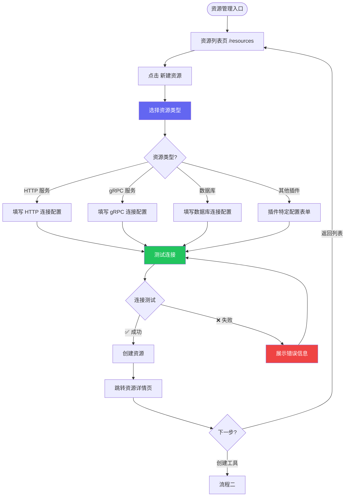
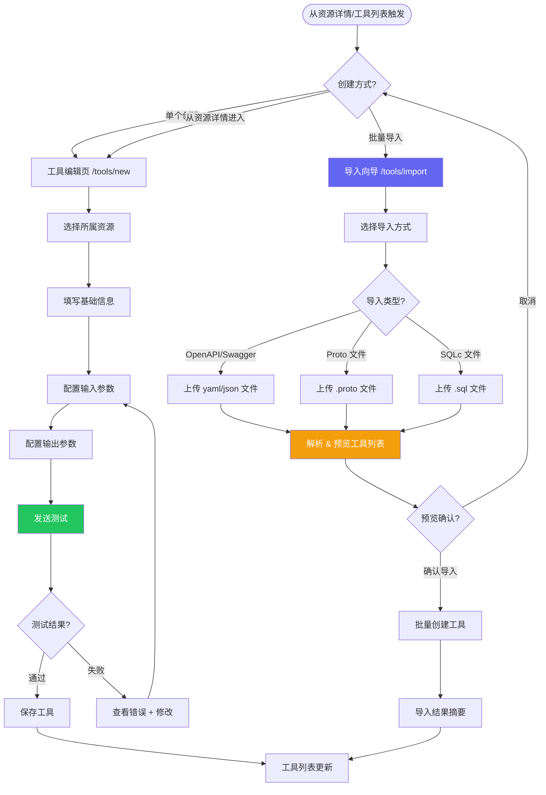
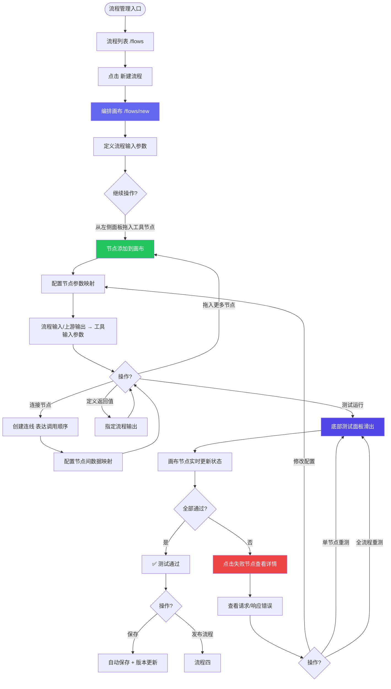
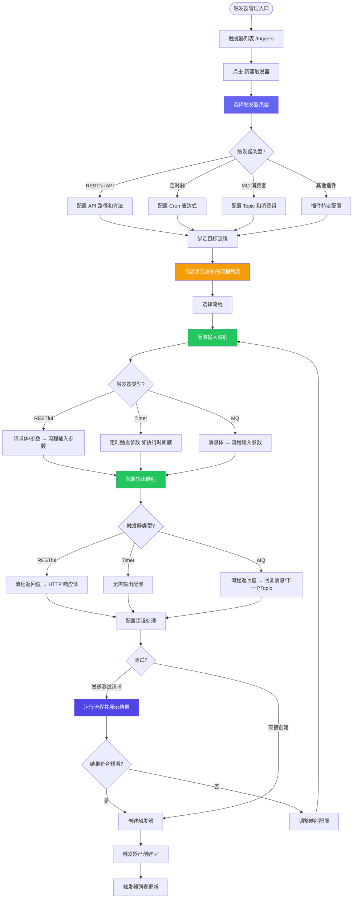
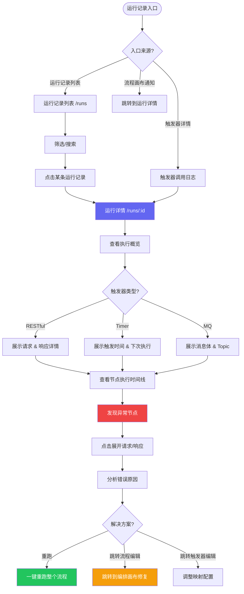

# 页面流程图 — API 编排平台

> 核心数据模型：**资源(Resource) → 工具(Tool) → 流程(Flow) → 触发器(Trigger)**  
> 所有流程图标注断点位置与优化方案。

---

## 1. 核心流程总览

```
┌─────────────────────────────────────────────────────────────────────────────┐
│                          用户核心操作路径                                     │
│                                                                             │
│  ① 创建资源 ──→ ② 创建/导入工具 ──→ ③ 发布工具 ──→ ④ 创建流程               │
│                                                    │                         │
│                                               ⑤ 编排节点                    │
│                                               ⑥ 配置映射                    │
│                                               ⑦ 调试测试                    │
│                                                    │                         │
│  ⑩ 监控运维 ←── ⑨ 触发器调用 ←── ⑧ 发布流程 + 创建触发器                     │
└─────────────────────────────────────────────────────────────────────────────┘
```

---

## 2. 流程一：创建资源



### 流程说明

| 步骤 | 页面 | 操作 | 反馈 |
|------|------|------|------|
| 选择类型 | 创建资源页 | 卡片式选择（HTTP/gRPC/DB/插件） | 选中态高亮 |
| 填写配置 | 创建资源页 | 根据类型展示不同表单 | 实时校验 |
| 测试连接 | 创建资源页 | 点击"测试连接"按钮 | 加载 → 成功✅ / 失败❌ + 错误详情 |
| 创建完成 | 资源详情页 | 自动跳转 | 成功 Toast |

---

## 3. 流程二：创建 & 导入工具



### 批量导入状态矩阵

| 导入类型 | 文件格式 | 解析产物 | 创建对象 |
|---------|---------|---------|---------|
| OpenAPI/Swagger | `.yaml` / `.json` | 解析 paths + operations | 每个操作 → 1 个工具 |
| Proto | `.proto` | 解析 services + methods | 每个 method → 1 个工具 |
| SQLc | `.sql` | 解析命名查询 | 每个查询 → 1 个工具 |

---

## 4. 流程三：流程编排（⭐ 核心流程）



### 节点配置面板交互细节

```
选中画布节点 → 右侧滑出配置抽屉
├── 节点信息区
│   ├── 工具名称: 创建用户
│   ├── 所属资源: 用户服务 (HTTP)
│   └── 工具版本: v2
├── Tab: 参数映射
│   ├── 输入映射表
│   │   ├── 流程参数 username → 工具参数 name
│   │   ├── 流程参数 email → 工具参数 email
│   │   └── 上游节点.output.userId → 工具参数 referrerId
│   └── [+ 添加映射]
├── Tab: 高级设置
│   ├── 重试策略: 失败重试 3 次
│   ├── 超时时间: 30s
│   └── 条件执行: 仅当 upstream.success === true
└── 操作栏
    ├── [▶ 测试此节点]
    └── [保存配置]
```

---

## 5. 流程四：发布 & 版本管理

```mermaid
flowchart TD
    START([在编排画布/流程列表触发]) --> A{发布对象?}

    A -->|发布工具| B[工具发布流程]
    A -->|发布流程| C[流程发布流程]

    %% 工具发布
    B --> B1[工具详情页 点击发布]
    B1 --> B2[发布确认弹窗]
    B2 --> B3{是否首次发布?}
    B3 -->|是 首次发布| B4[工具状态 → 已发布 v1]
    B3 -->|否 更新发布| B5[自动检测下游依赖流程]
    B5 --> B6[展示影响分析]
    B6 --> B6a[依赖流程列表 + 工作空间归属]
    B6 --> B6b[接口变更对比 Breaking/Non-breaking]
    B6a --> B7[确认发布新版本]
    B7 --> B8[工具状态 → 已发布 v(n+1)]
    B4 --> B9[通知下游流程标记可升级]
    B8 --> B9
    B9 --> B10[流程编排画布中显示 🔄 升级提醒]
    B10 --> B11[开发者手动升级工具版本]
    B11 --> B12{参数兼容?}
    B12 -->|兼容 自动迁移| B13[节点升级完成 重新测试发布流程]
    B12 -->|不兼容| B14[展示参数差异 需手动调整映射]
    B14 --> B13
    B4 --> B5[其他工作空间的流程中可使用该工具]

    %% 流程发布
    C --> C1[编排画布 点击发布]
    C1 --> C2[发布确认弹窗]
    C2 --> C3[展示变更摘要]
    C3 --> C4[生成新版本号]
    C4 --> C5[流程状态 → 已发布]
    C5 --> C6[可被触发器绑定]

    %% 版本管理
    B4 --> D[版本历史]
    C5 --> D
    D --> D1[查看版本列表]
    D1 --> D2[对比两个版本]
    D2 --> D3{操作?}
    D3 -->|回滚| D4[确认回滚到指定版本]
    D3 -->|查看| D5[查看版本快照 只读]

    %% 下线保护
    B --> E[尝试下线工具]
    E --> E1{是否有流程引用该工具?}
    E1 -->|有引用| E2[阻止下线 展示依赖流程列表]
    E2 --> E3[需先在相关流程中移除该工具节点]
    E3 --> E4[再次尝试下线]
    E4 --> E1
    E1 -->|无引用| E5[确认下线]
    E5 --> E6[工具状态 → 已下线]

    style B2 fill:#F59E0B,color:#fff
    style C2 fill:#F59E0B,color:#fff
    style B4 fill:#22C55E,color:#fff
    style B5 fill:#3B82F6,color:#fff
    style B8 fill:#22C55E,color:#fff
    style C5 fill:#22C55E,color:#fff
    style E2 fill:#EF4444,color:#fff
```

> **关键约束**：
> - 只有已发布的工具才能在流程中被调用，只有已发布的流程才能被触发器绑定
> - 流程创建时锁定引用工具的具体版本，工具更新后需在编排画布中手动升级节点版本
> - 有流程引用的工具不允许下线，必须先在所有依赖流程中移除该工具节点

---

## 6. 流程五：创建触发器



### 触发器映射配置说明

| 触发器类型 | 输入映射 | 输出映射 |
|-----------|---------|---------|
| **RESTful API** | HTTP 请求体/Header/Query → 流程输入参数 | 流程返回值 → HTTP 响应体/状态码 |
| **定时器** | 系统注入（触发时间戳、执行编号等）→ 流程输入 | 无（结果记录到运行日志） |
| **MQ 消费者** | 消息体/Header → 流程输入参数 | 流程返回值 → 回复消息或转发下一个 Topic |

---

## 7. 流程六：运行监控 & 问题排查



---

## 8. 跨流程跳转矩阵

| 起始页面 | 目标页面 | 触发方式 | 携带上下文 |
|---------|---------|---------|-----------|
| 资源列表 → 资源详情 | 点击资源行 | 资源 ID |
| 资源详情 → 工具列表 | 点击"查看工具" | 资源 ID（筛选） |
| 资源详情 → 创建工具 | 点击"添加工具" | 资源 ID（预选） |
| 工具列表 → 工具编辑 | 点击工具行 / 新建 | 工具 ID（编辑时） |
| 工具编辑 → 流程画布 | "在流程中使用" | 工具 ID |
| 流程列表 → 流程画布 | 点击流程行 / 新建 | 流程 ID（编辑时） |
| 流程画布 → 运行详情 | 点击运行记录 | 运行 ID |
| 流程画布 → 工具详情 | 右键节点"查看工具" | 工具 ID + 返回流程 ID |
| 触发器列表 → 触发器详情 | 点击触发器行 | 触发器 ID |
| 触发器详情 → 流程画布 | 点击绑定流程 | 流程 ID |
| 触发器详情 → 运行详情 | 点击调用日志 | 运行 ID |
| 运行详情 → 流程画布 | "编辑流程" | 流程 ID |
| 运行详情 → 触发器详情 | "查看触发器" | 触发器 ID |
| 任何页面 → 登录页 | Session 过期 | 原页面 URL |

---

## 9. 快捷键映射

| 快捷键 | 作用域 | 操作 |
|--------|-------|------|
| `Cmd/Ctrl + S` | 工具编辑 / 流程画布 | 保存 |
| `Cmd/Ctrl + Z` | 流程画布 | 撤销 |
| `Cmd/Ctrl + Shift + Z` | 流程画布 | 重做 |
| `Cmd/Ctrl + Enter` | 流程画布 | 运行流程 |
| `Delete / Backspace` | 流程画布（选中节点） | 删除节点/连线 |
| `Cmd/Ctrl + D` | 流程画布（选中节点） | 复制节点 |
| `Cmd/Ctrl + F` | 列表页 / 搜索面板 | 聚焦搜索 |
| `Escape` | 流程画布 | 关闭抽屉 / 取消选择 |
| `Space + 拖拽` | 流程画布 | 平移画布 |
| `Cmd/Ctrl + 滚轮` | 流程画布 | 缩放画布 |
| `Cmd/Ctrl + E` | 工具列表 | 快速导入 |
